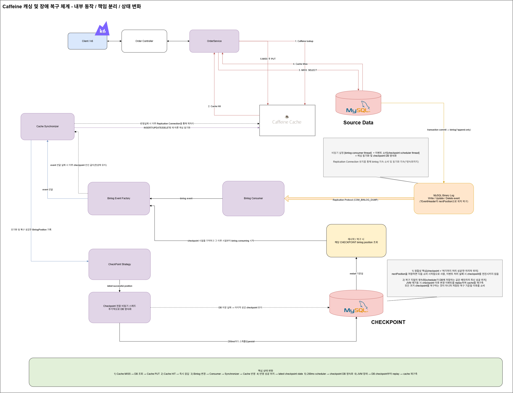
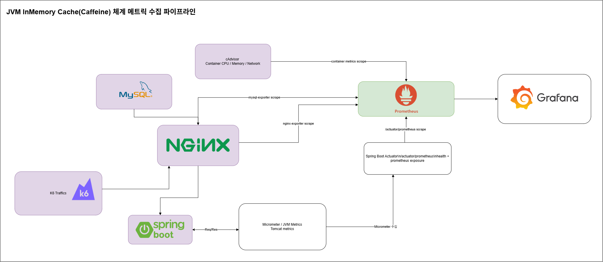

**자세한 내용은 벨로그를 통해 자세히 기술 :**
- [부하 분산 : Redis 시리즈 #1](https://velog.io/@gyrbs22/%EB%B0%B1%EC%97%94%EB%93%9C-Redis%EC%97%90-%EB%8C%80%ED%95%9C-%EA%B3%A0%EC%B0%B0Redis%EC%97%90%EC%84%9C-%EB%B0%9C%EC%83%9D%EA%B0%80%EB%8A%A5%ED%95%9C-%EB%8B%A4%EC%96%91%ED%95%9C-%EC%8B%A4%EB%AC%B4%EC%A0%81-%EC%83%81%ED%99%A9%EA%B3%BC-%EC%9D%B4%EC%97%90-%EB%8C%80%ED%95%9C-Trouble-Shootings-3-TDD%EA%B8%B0%EB%B0%98%EC%9D%98-Redis-Patterns-trouble-Shootings-1)
- [부하 분산 : Reids 시리즈 #2](https://velog.io/@gyrbs22/%EB%B0%B1%EC%97%94%EB%93%9C-Redis%EC%97%90-%EB%8C%80%ED%95%9C-%EA%B3%A0%EC%B0%B0Redis%EC%97%90%EC%84%9C-%EB%B0%9C%EC%83%9D%EA%B0%80%EB%8A%A5%ED%95%9C-%EB%8B%A4%EC%96%91%ED%95%9C-%EC%8B%A4%EB%AC%B4%EC%A0%81-%EC%83%81%ED%99%A9%EA%B3%BC-%EC%9D%B4%EC%97%90-%EB%8C%80%ED%95%9C-Trouble-Shootings-4-TDD%EA%B8%B0%EB%B0%98%EC%9D%98-Redis-Patterns-trouble-Shootings-2)
- [부하 분산 : Caffeine 캐싱/MySQL binlog와 Debezium을 활용한 캐싱 동기화/JVM 장애 복구](https://github.com/LEEHyokyun/spring-boot-bottleneck-points-and-binlog-and-caffeine)
- [부하 조절 : Circuit Breaker/Semaphore Bulkhead](https://velog.io/@gyrbs22/%EB%B0%B1%EC%97%94%EB%93%9C-%EB%B6%84%EC%82%B0-%ED%8A%B8%EB%9E%9C%EC%9E%AD%EC%85%98-Trouble-ShootingCircuit-Breaker-%EB%B0%8F-MSA-%EC%84%9C%EB%B2%84-%EB%B3%84-%EB%B6%84%EC%82%B0%EC%B6%94%EC%A0%81%EB%AA%A8%EB%8B%88%ED%84%B0%EB%A7%81-%ED%99%98%EA%B2%BD-%EA%B5%AC%EC%84%B1-%EB%B0%A9%EC%95%88)
- [부하 조절 : 인프라 구축없이 Servlet Filter/JVM Blocking Queue/Semaphore 만으로 Saturation 2배 개선](https://velog.io/@gyrbs22/%EB%B0%B1%EC%97%94%EB%93%9C-%EC%8B%9C%EC%8A%A4%ED%85%9C%EA%B3%BC-%EA%B0%80%EC%9E%A5-%EC%89%BD%EA%B3%A0-%EA%B0%95%EB%A0%A5%ED%95%98%EA%B2%8C-%EC%83%81%ED%98%B8%EC%9E%91%EC%9A%A9-%ED%95%A0-%EC%88%98-%EC%9E%88%EB%8A%94-%EB%B0%A9%EB%B2%95-4-Series3-%EB%B6%80%ED%95%98%EC%A1%B0%EC%A0%88%EA%B3%BC-%EC%8B%9C%EC%8A%A4%ED%85%9C-Admission-ControllerInner-Semaphore)
- [GC튜닝 및 GC Pause Time 개선/WAS latency와의 상관관계 시리즈 #1](https://velog.io/@gyrbs22/%EB%B0%B1%EC%97%94%EB%93%9C-%EC%8B%9C%EC%8A%A4%ED%85%9C%EA%B3%BC-%EA%B0%80%EC%9E%A5-%EC%89%BD%EA%B3%A0-%EA%B0%95%EB%A0%A5%ED%95%98%EA%B2%8C-%EC%83%81%ED%98%B8%EC%9E%91%EC%9A%A9-%ED%95%A0-%EC%88%98-%EC%9E%88%EB%8A%94-%EB%B0%A9%EB%B2%95-2-%EB%AA%A8%EB%8B%88%ED%84%B0%EB%A7%81-%EA%B7%B8%EB%A6%AC%EA%B3%A0-%EB%B3%91%EB%AA%A9%ED%95%B4%EC%86%8C%EC%9D%98-%EA%B4%80%EC%A0%901000-RPS-%ED%99%98%EA%B2%BD%EC%9D%84-%EA%B5%AC%ED%98%84%ED%95%98%EC%97%AC-DBWAS-level%EC%97%90%EC%84%9C-%EA%B0%81-%EC%A7%80%EC%A0%90%EB%B3%84-%EC%A0%81%EC%9A%A9%ED%95%9C-%EA%B0%9C%EC%84%A0-%EB%B0%A9%EC%95%88%EA%B0%9C%EC%84%A0%EB%A5%A0-%EB%B9%84%EA%B5%90-Series1%ED%8C%8C%EC%9D%B4%ED%94%84%EB%9D%BC%EC%9D%B8-%EA%B5%AC%EC%B6%95)
- [GC튜닝 및 GC Pause Time 개선/WAS latency와의 상관관계 시리즈 #2](https://velog.io/@gyrbs22/%EB%B0%B1%EC%97%94%EB%93%9C-%EC%8B%9C%EC%8A%A4%ED%85%9C%EA%B3%BC-%EA%B0%80%EC%9E%A5-%EC%89%BD%EA%B3%A0-%EA%B0%95%EB%A0%A5%ED%95%98%EA%B2%8C-%EC%83%81%ED%98%B8%EC%9E%91%EC%9A%A9-%ED%95%A0-%EC%88%98-%EC%9E%88%EB%8A%94-%EB%B0%A9%EB%B2%95-3-%EC%84%B1%EB%8A%A5-%EA%B0%9C%EC%84%A0-%EB%AA%A8%EB%8B%88%ED%84%B0%EB%A7%81Saturation%EC%9D%B4-%EB%B0%9C%EC%83%9D%ED%95%98%EC%98%80%EC%9D%84%EB%95%8C-DBWAS-%EA%B3%84%EC%B8%B5%EB%B3%84-%EC%A0%81%EC%9A%A9%ED%95%9C-%EA%B0%9C%EC%84%A0-%EB%B0%A9%EC%95%88%EA%B0%9C%EC%84%A0%EB%A5%A0-%EB%B9%84%EA%B5%90-Series2%EA%B0%9C%EC%84%A0%EC%A0%90-%EC%A0%81%EC%9A%A9%EA%B3%BC-%EA%B0%9C%EC%84%A0%EB%A5%A0-%EB%B9%84%EA%B5%90)

## 1. 개요

> 시스템 병목이 집중되는 지점에서 부하를 분산하여 개선효과를 살펴보도록 한다.

Redis는 분명 강력하다. 하지만 실무에 따라 무조건적인 공식은 아닐 수 있다.<br/>
실무 예산 및 자원 제약 등으로 인해 Redis를 사용하지 못할때, 이에 준하는 상황에 의해 Local Cache를 사용해야 할때, 이에 준하는 성능을 낼 수 있을까라는 의문에서 출발한다.

> JVM InMemory Caching을 사용하면서 시스템 성능을 향상하고, JVM 장애 시 CHECKPOINT 기록에 기반한 복구 체계 구축이 본 프로젝트의 핵심이다.



## 2. 테스트 시나리오

중요한 것은 Redis를 대체할 만큼의 파이프라인을 구축하면서, local Cache의 부하 분산 효과를 최대한 확보할 수 있는 방안을 설계하는 것이다.



이에 대한 체계를 구현하면서 고려한 사항은 아래 3가지이다.
- 캐싱데이터 동기화를 최대한 간단하고 빠르게 진행해야 하며, 처리 성능에 영향을 주지 말아야 한다.
- Kafka는 디스크에 데이터를 저장하지만 append-only 원리에 의해 속도가 빠르다. 동기화 과정을 빠르게 하기위해 이 원리를 이용한다.
- JVM이 다운되었을때 캐싱의 위치를 기억하기 위한 별도의 체계를 구축하고, 이 역시 처리 성능에 영향을 주지 말아야 한다.

그리고, 최종적으로 Caffeine caching 체계를 구축하기 전/후로 얼마나 시스템 성능이 좋아지는지, 시스템의 성능 임계치가 얼마나 개선되는지 개선효과이다.

## 3. Local Cache 체계 설계

Caffeine을 단순히 적용한 locacl cache 체계로는 실용성이 없기에, Redis의 기능을 어느 정도 보완할 수 있는 수준으로 파이프라인을 설계한다.

즉, 
- 상기 기술한 고려사항처럼 동기화 파이프라인이 처리 성능에 영향을 주지 말아야 한다.
- JVM이 다운되었을때 캐싱 데이터를 다시 복구할 수 있는 등 영속성을 어느 정도는 갖춰야 한다.

이에 대한 설계 방안을 여러 방면으로 고민하였고, 아래 4가지 사항을 중점적으로 구축하였다.
- 동기화 체계의 빠른 속도는 append-only 기반의 binlog event 및 이를 consume하는 서버
- 가장 최근에 진행한 GTID(이벤트)는 별도의 DB(디스크) Checkpoint에 저장
- 처리속도에 영향을 주지 않기 위해 이벤트 체크포인트(캐싱데이터의 영속화)는 별도의 배치로 책임 분리
- 동기화 주기는 수용가능한 수준으로 진행하며, 100~200ms 전후로 시스템 영향도를 비교하면서 진행

```
                           ┌─────────────────────────────┐
                           │            MySQL          │
                           │                           │
                           │  Business Data            │
                           │  cache_binlog_checkpoint  │
                           └──────────────┬──────────────┘
                                          │
                                  Binary Log Stream
                                          │
                                          ▼
                              ┌──────────────────────┐
                              │   Binlog Consumer    │
                              │                      │
                              │  consume event       │
                              │       │              │
                              │       ▼              │
                              │  parse row event     │
                              │       │              │
                              │       ▼              │
                              │  update Caffeine     │
                              │       │              │
                              │       ▼              │
                              │  latest GTID         │
                              └───────┬──────────────┘
                                     │
                     ┌────────────────┴────────────────┐
                     │                              │
                     ▼                              ▼
              Caffeine Local Cache              Checkpoint Buffer
                     │                              │
                     │                           Asynched Thread
                     │                               │
                     │                               ▼
                     │                         MySQL checkpoint
                     │
                     ▼
                HTTP Request
                     │
                     ▼
                 Cache HIT
                     │
                     ▼
                  Response


                 Cache MISS
                     │
                     ▼
                   MySQL
                     │
                     ▼
                  Caffeine
```

Binlog를 Consume하는 부분은 Kafka의 원리를 차용하였다.

| Kafka                    | 네 구조                          |
| ------------------------ | ----------------------------- |
| Producer                 | MySQL의 변경 작업                  |
| Append-only Log          | **MySQL Binlog**              |
| Sequential disk write    | **Binlog의 순차 기록**             |
| Consumer                 | JVM Binlog Consumer           |
| Offset                   | GTID / Binlog position        |
| Consumer가 offset부터 순차 읽기 | JVM이 Binlog stream 순차 consume |
| Consumer가 처리한 위치 저장      | MySQL checkpoint              |

Kafka는 디스크임에도 불구하고 처리속도가 빠른데, 이에 대한 원리(append-only)를 활용한다.

```
             MySQL
                │
       ┌────────┴────────┐
       │                 │
       ▼                 ▼
   Business DB         Binlog
                         │
                  "Kafka-like"
                  append-only log
                         │
                         ▼
                   JVM Consumer
                         │
                         ▼
                     Caffeine
```

데이터 동기화 과정은 Replication Connection(Protocol)를 사용하여, 철저하게 처리 프로세스와 분리하여 성능에 영향을 주지 않도록 한다.

전체적인 Thread의 구조는 다음과 같다.

```
JVM
│
├─ Tomcat Threads
│    └─ HTTP 요청 처리
│
├─ HikariCP
│    └─ JDBC Connection 관리
│
└─ Binlog Consumer Thread
     │
     ├─ MySQL Replication Connection
     │
     └─ Binlog Event 수신
           │
           ▼
       Caffeine.put()
```

상기와 같이 binlog event를 전달받아서 처리를 위한 과정에 어떠한 영향도 주지 않고, 별도의 스레드가 생성되어 전용 파이프라인을 담당한다.

```
                 MySQL
                   │
                Binlog
                   │
                   ▼
          ┌─────────────────┐
          │ Debezium Conn   │  ← 1개
          └────────┬────────┘
                   │
                   ▼
          ┌─────────────────┐
          │ BinlogConsumer  │  ← 1개
          └────────┬────────┘
                   │
             CacheChangeEvent
                   │
          ┌────────┴────────┐
          ▼                 ▼
     Cache 동기화       BinlogPosition 기억
```

또한 Binlog를 읽는 스트림은 하나로 이어서, LogClient에 연결하여 binlog의 이벤트를 연결하며 이 이벤트를 LogConsumer가 받아서 처리한다.<br/>
이때, Cache 데이터 동기화와 binlogPosition을 기억하며, 기억한 binlogPosition을 기반으로 CHECKPOINT에 영속화한다.

## 4. 책임분리

생명주기를 동기화-영속화-체크포인트 상태 저장으로 크게 3가지 핵심 체계로 나누고, 이를 구축하기 위해 6개의 책임으로 분리하여 진행한다.

```scss
CaffeineRecoveryCoordinator
    ↓
CaffeineRecoveryHandler
    ↓
MySqlBinlogConsumer
    ↓
BinlogEventFactory
    ↓
CaffeineSynchronizer
    ↓
CheckpointStrategy
```

1) CaffeineRecoveryCoordincator
- 최초 JVM 구동(혹은 재구동) 시 DB에 남아있는 체크포인트 정보 확보
- 이후 캐싱 데이터 복구 및 binlog connection 및 누락된 binlog를 캐싱 데이터에 반영

최초 구동 시 위 두가지가 발생하는데, 이 책임을 각각 CaffeineRecoveryHandler, MySqlBinlogConsumer로 분리하기 위해 이를 중재하는 Adapter이다.

2) CaffeineRecoveryHandler
- 캐싱 데이터 복구 및 체크포인트의 복구

Coordinator에서 최초로 진행하는 과정은 체크포인트 복구 후 이를 현재 상태로 기억하는 것이다.

3) MySqlBinlogConsumer
- 전달받은 체크 포인트 상태를 현재 상태로 기억
- raw binlog 이벤트를 수신(MySQL binlog와 연결을 지속하면서 이벤트 스트리밍)

말 그대로, 복구한 체크포인트를 자신의 상태로 기억하고 그 이후 binlog Replication connection을 통해 누락된 데이터 내역을 반영한다.

4) BinlogEventFactory
- raw Event → 우리가 사용할 BinlogEvent로 변환

```
Event
 ↓
BinlogEvent
```

5) CaffeineSynchronizer
- BinlogEvent를 받아 현재 체크포인트 지점을 기억하고, 이를 Caffeine Cache에 반영(캐싱데이터 동기화)

```
INSERT → put
UPDATE → put
DELETE → evict
```

6) CheckpointStrategy
- 동기화가 성공한 위치를 어디에 기록할지 결정(BinlogPosition에 기반한 데이터 영속화 및 JVM 복구 지점 기록)

```
BinlogPosition
      ↓
checkpoint 저장
```

CHECKPOINT에 데이터를 영속화하여 JVM 중단 후 재시작 시 캐싱 데이터 복구 및 동기화 반영에 활용한다.

```
                 MySQL
                   │
                   │ Binlog
                   ▼
          BinaryLogClient
                   │
                   │ Event
                   ▼
       ┌──────────────────────┐
       │ MySqlBinlogConsumer  │
       │                      │
       │ - Event 수신          │
       │ - currentBinlogFile  │
       └──────────┬───────────┘
                  │
                  ▼
       ┌──────────────────────┐
       │ BinlogEventFactory   │
       │                      │
       │ Event → BinlogEvent  │
       └──────────┬───────────┘
                  │
                  ▼
       ┌──────────────────────┐
       │ CaffeineSynchronizer │
       │                      │
       │ INSERT → put         │
       │ UPDATE → put         │
       │ DELETE → evict       │
       └──────────┬───────────┘
                  │
                  ├───────────────┐
                  ▼               ▼
       ┌────────────────┐   ┌────────────────────┐
       │ CaffeineHandler│   │ CheckPointStrategy │
       │                │   │                    │
       │ put/evict/get  │   │ checkpoint 저장     │
       └───────┬────────┘   └────────────────────┘
               │
               ▼
          Caffeine Cache
```

## 4-1. Cache 동기화

변경 이벤트가 발생하면 해당 binlog 상태를 기억하고, 인메모리 캐싱 데이터에 동기화 작업을 진행(복구)한다.

```
이벤트 4
  ↓
Caffeine 동기화 성공
  ↓
nextPosition = 500
  ↓
InMemoryCheckPointStrategy
  ↓
checkpoint = 500
```

## 4-2. 데이터 영속화(장애 복구)

MySQL을 영속화 도구로 이용하여, 캐싱한 데이터를 Checkpoint로 저장해둔다.<br/>
건 by 건으로 진행되는 처리마다 모두 영속화하지 않고, 300ms마다 별도 스케쥴러 thread가 queue에 쌓인 내역들을 체크포인트로 저장(영속화)한다.

```
JVM 시작
  │
  ▼
CaffeineRecoveryCoordinator
  │
  ▼
CaffeineRecoveryHandler
  │
  ├─ CHECKPOINT 조회
  │
  │   없음
  │
  ▼
Hot data 적재
  │
  ▼
MySqlBinlogConsumer.start() (*MySQL Binlog 연결)
  │
  ▼
BinaryLogClient 생성
  │
  ▼
Binlog 연결 스레드 생성 후 binlog 지속 순회 및 동기화/복구
```

CHECKPOINT 지점을 JVM 시작 지점에서 기억하고, 이 정보를 바탕으로 binlog 지점을 순회하면서 복구 및 동기화한다.

## 4-3. Cache Aside

서비스 호출 시 캐싱작업을 공통관심사로 분리하여 Cache Hit/Miss에 대한 처리를 진행.

## 5. 테스트 결과

|      캐싱 적재율 | 임계 Throughput |     TPS 개선률 |          P95 |     P95 개선률 |            P99 |     P99 개선률 |
| ----------: | ------------: | ----------: |-------------:| ----------: |---------------:| ----------: |
| **평시 (0%)** |  **81.1 TPS** |          기준 | **21,000ms** |          기준 |   **27,000ms** |          기준 |
|      **1%** |             - |           - |            - |           - |              - |           - |
|     **20%** |             - |           - |            - |           - |              - |           - |
|     **40%** |   **384 TPS** | **+373.5%** | **16~423ms** |  **+98.0%** | **15~4,814ms** |  **+82.2%** |
|     **60%** |   **390 TPS** | **+380.9%** | **14~193ms** | **+99.08%** |   **15~622ms** | **+97.70%** |
|    **100%** |   **391 TPS** | **+382.1%** |   **14.6ms** | **+99.93%** | **≈14~190ms*** | **≈99.30%** |

그리고, 확실히 부하조절 체계보다 지금의 캐싱(부하분산) 체계가 성능이 훨씬 좋아졌기에, 이에 대한 개선률을 각 방안별로 비교.

| 항목        | Admission Control + Semaphore |       Local Cache |     Cache가 더 개선한 정도 |
| --------- | ----------------------------: | ----------------: | ------------------: |
| 대상        |                         WRITE |              READ |                   - |
| 개선 전      |                   **120 TPS** |     **81~90 TPS** |               기준 상이 |
| 개선 후      |               **220~230 TPS** |   **384~391 TPS** |                   - |
| 절대 처리량 증가 |              **+100~110 TPS** |  **+294~310 TPS** |      **약 2.7~3.1배** |
| 개선률       |               **+83.3~91.7%** | **+326.7~382.7%** | **약 3.6~4.6배의 개선률** |
| 처리량 배수    |                **1.83~1.92배** |    **4.27~4.83배** |      **약 2.3~2.6배** |

처리대상(WRITE/READ)는 달랐지만, 성능 개선 효과는 캐싱이 확실.<br/>
※ Caching Hit P95/P99 latency의 1.37배 수준까지 비동기 캐싱 동기화 P95/P99 latency를 유지할 수 있었다(19~20ms)

## 6. 결론

시스템 성능에 영향을 미치는 요인은 캐싱 데이터가 적재되어있는 비율, 절대적인 수치가 중요한 것이 아니다.

> 최대한 수많은 요청에 대해 Cache Hit을 하도록 하여, Cache Miss Rate를 줄인다면 시스템 성능을 최대한 개선할 수 있다.

즉,

> 초반 Cache Miss가 많이 발생하더라도, 향후 Cache Hit를 많이 발생시켜 Hit/Miss의 비율을 적절하게 유지한다면, 시스템의 성능을 완화하고 안정화시킬 수 있다.

초반에 Cache Miss가 발생할 수 있어도, 부하가 커지면서 그만큼 캐싱되는 데이터가 많아졌기에 시간이 지날수록 시스템 성능이 좋아졌던것이다. <br/>
캐싱 데이터의 비율이 중요한 것이 아니라, **요청의 cache Hit 여부**, 바로 그 차이이다.

따라서, hot data에 대한 캐싱체계를 구축하여 cache Hit를 늘릴 수 있다면, 시스템 임계 성능을 상당부분 향상할 수 있다.

하지만 실무에서는 hot data를 캐싱하고, 이에 대한 TTL을 영구적으로 유지할 수 없기에, 캐싱한 hot data를 오래 유지하기보다는 cache hit를 최대한 늘릴 수 있는 방향으로 캐싱 전략을 구성하는 것이 좋겠다.

## 참고. MySQL Replication Protocol - COM_BINLOG_DUMP

> Replication Protocol

Debezium이 MySQL Replication Protocol에서 사용하는 COM_BINLOG_DUMP 패킷 필드로 변환한다.

```
MySQL Server
   │
   │ Binary Log
   │
   ├── mysql-bin.000001
   │      ├── event
   │      ├── event
   │      ├── event
   │      └── event
   │
   ├── mysql-bin.000002
   │      ├── event
   │      ├── event
   │      └── ...
   │
   └── mysql-bin.000003
          ├── event
          ├── event
          └── ...
```

각 binlog 파일에는 이벤트가 쌓여있고, 각 이벤트는 본인의 위치 정보가 기록되어있다.<br/>
이때, 각 위치정보를 기억하여 COM_BINLOG_DUMP 패킷을 보내 그 이후부터 읽으라는 명령을 수행하는 것이다.

> COM_BINLOG_DUMP

Replication Protocol은 MySQL Client/Server Protocol command를 보낼 수 있는 채널인데, 우리가 debezium을 통해 보내는 command는 COM_BINLOG_DUMP이다.

```java
client.setBinlogFilename(
                    INITIAL_BINLOG_FILE
            );

            client.setBinlogPosition(
                    INITIAL_BINLOG_POSITION
            );
```

COM_BINLOG_DUMP 패킷의 필드로 변환하기 위해 애플리케이션 레벨에서 해당 정보를 캡슐화하는 과정이다.